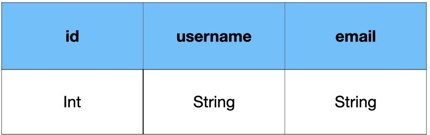
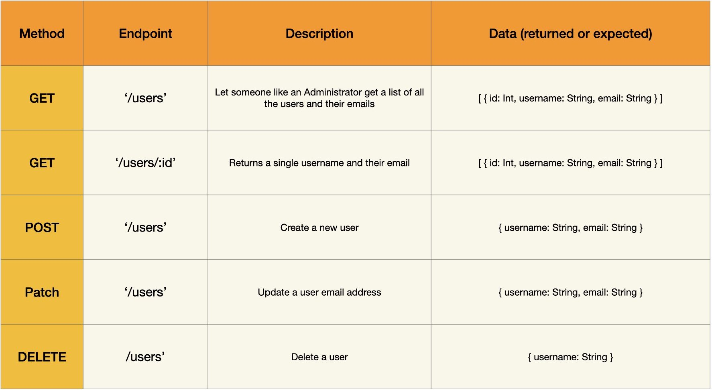

# Node Server Practice

A Node/Express API practice server

> Motivation: This repo is intended to give students a place to solidify their Node/Express Server fundamentals.

## Directions

1. Connect the server to a data base of your choosing. Provided code is for MySQL 5.7
2. Set up a body parser for the type of data you will be sending. JSON is recommended
3. Start the server insuring everything is running and connected

Use Postman or similar tool as your Client to send requests to the server

4. Work your way down the provided endpoints. Handle incoming requests, interact with the data base, send an appropriate response. Don't forget error handling.

### Hints

* Check your work often with console.log() and postman to catch bugs early and help you visualize the data flow.

* Start with callbacks, refactor to promises, then refactor to async/await

### Schema and API's

The provided Schema file will create a singe table with the following columns. This will work with a SQL data base like MySQL or PostgreSQL. If you choose to use a NoSQL database you will need to create your own schema for your documents.

There are 5 provided routes to be filled in by the student. This table will give you an idea of what each route should do, and how to pass data to the server, either in the url or in the body of the request.

